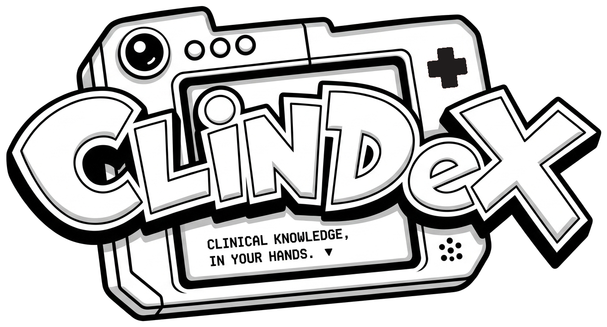

<p align="center">
  
</p>

# ClinDex

> AI-assisted prescription validation and clinical decision support system.  
> **Live App**: [https://clindex.joanathan.in](https://clindex.joanathan.in)

[](https://nextjs.org/)
[](https://www.typescriptlang.org/)
[](https://supabase.com/)
[](https://groq.com/)

---

### Overview

Clindex validates multi-drug regimens against patient physiology (eGFR, hepatic function, age, conditions) to catch adverse drug-drug and drug-disease interactions with zero missed contraindications.

- **Adaptive Intake**: Queries missing clinical clearance markers before running checks.
- **Grounded Verification**: Cross-references candidate drugs with RxNorm and OpenFDA to prevent hallucinations.
- **Tiers & Alternatives**: Categorizes risks into `Avoid`, `Caution`, or `Safe` with evidence-backed substitutes.

---

### Performance

| Metric | Result | Benchmark |
|---|---|---|
| **Safety Recall** | **100%** | 0 missed contraindications across test cohorts |
| **Harmonic F1** | **0.909** | Minimal alert fatigue |
| **Accuracy** | **85.7%** | Grounded multi-class classification |
| **Latency** | **~5.2s** | Groq LPU inference vs. 5–10 min manual review |

---

### Quickstart

```bash
git clone https://github.com/JoanathanPS/Clindex.git
cd Clindex/web
npm install
npm run dev
```

---

### Author's Note

> "I built Clindex because catching dangerous drug interactions shouldn't mean drowning in alert fatigue or deciphering dense formularies at 1am. Every interaction is grounded in clinical datasets with transparent biological mechanisms and actionable alternatives — built to solve a real clinical problem, not just demo an AI prompt."
>
> **Joanathan Packia Singh** · [Read my résumé →](https://joanathan.in/)

---

<sub>⚠️ **Disclaimer**: Research and educational prototype only. Not a certified medical device. Decision support only.</sub>